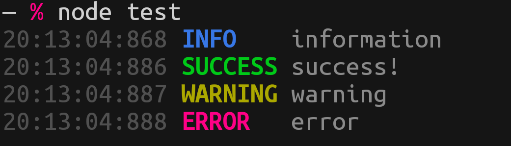

## Colorlogs

A colorful logger for your Node.js console.

> Installation:
```bash
$ npm install git+https://github.com/theRealAyan/colorlogs.git
$ yarn add git+https://github.com/theRealAyan/colorlogs.git
```
> Usage: 
```js
import * as logger from 'colorlogs';
//or
const logger = require('colorlogs');

logger.info('information');
logger.success('success!');
logger.warn('warning');
logger.error('error');
```

> Output: 

